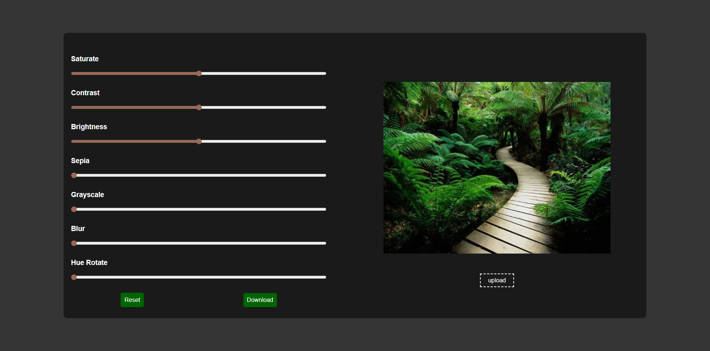
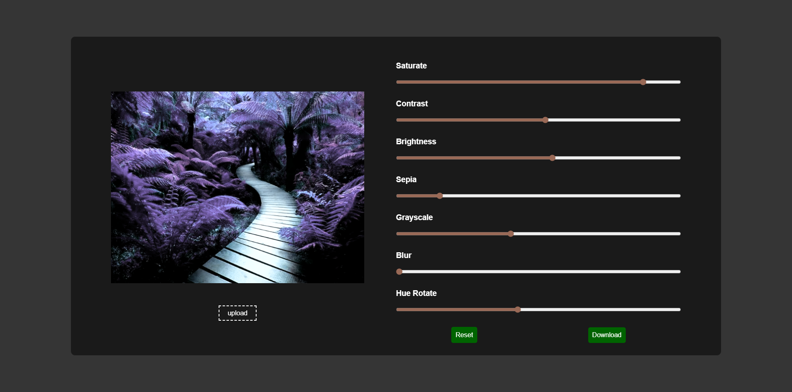

# 🎨 Photo Editor Web



## 📖 About the Project

A powerful yet simple **web-based photo editor** that allows you to apply various filters and effects to your images in real-time. Built with pure vanilla JavaScript and HTML5 Canvas API for instant image manipulation without any external libraries.

---

## 🌐 Live Demo

🔗 [View Demo](https://mohammed-004del.github.io/mohamed-webdev-Photo_Editor/) 

---

## 🛠️ Tech Stack


---

## ✨ Features

- ✅ **Multiple Filters**: Saturate, Contrast, Brightness, Sepia, Grayscale, Blur, and Hue Rotate
- ✅ **Real-time Preview**: See changes instantly as you adjust sliders
- ✅ **One-Click Reset**: Restore original image settings
- ✅ **Download Edited Image**: Save your edited photo as PNG
- ✅ **Responsive Design**: Works seamlessly on desktop and mobile devices
- ✅ **No Dependencies**: Pure vanilla JavaScript with HTML5 Canvas

---

## 📸 Screenshots

### Original Image


### With Filters Applied


---

## 🎯 How to Use

1. **Upload an Image**: Click the "upload" button and select your photo
2. **Adjust Filters**: Use the sliders to apply different effects:
   - **Saturate** (0-200%): Adjust color intensity
   - **Contrast** (0-200%): Control light/dark difference
   - **Brightness** (0-200%): Make image lighter or darker
   - **Sepia** (0-200%): Apply vintage brown tone
   - **Grayscale** (0-1): Convert to black and white
   - **Blur** (0-10px): Add blur effect
   - **Hue Rotate** (0-350°): Shift color spectrum
3. **Reset**: Click "Reset" to restore original settings
4. **Download**: Click "Download" to save your edited image

---

## ⚙️ Installation

Clone the repository:

```bash
git clone https://github.com/yourusername/photo-editor](https://github.com/Mohammed-004del/mohamed-webdev-Photo_Editor.git
```

Navigate to the project directory:

```bash
cd photo-editor
```

Open `index.html` in your browser:

```bash
# On macOS
open index.html

# On Linux
xdg-open index.html

# On Windows
start index.html
```

Or use a local server:

```bash
# Using Python 3
python -m http.server 8000

# Using Node.js (http-server)
npx http-server
```

Then open `http://localhost:8000` in your browser.

---

## 📁 Project Structure

```
photo-editor/
├── index.html          # Main HTML structure
├── style.css           # Styling and responsive design
├── script.js           # JavaScript logic for filters
```

---

## 🔧 Code Highlights

### Canvas Filter Application
```javascript
ctx.filter = `
    saturate(${Saturate.value}%)
    contrast(${Contrast.value}%)
    brightness(${Brightness.value}%)
    sepia(${Sepia.value}%)
    grayscale(${Grayscale.value})
    blur(${Blur.value}px)
    hue-rotate(${Hue_Rotate.value}deg)
`;
ctx.drawImage(img, 0, 0, canvas.width, canvas.height);
```

### Image Download
```javascript
Download.onclick = function(){
    Download.href = canvas.toDataURL("image/png");
}
```

---

## 🚀 Future Enhancements

- Add more filters (Invert, Opacity, Drop Shadow)
- Implement crop and rotate functionality
- Add text overlay feature
- Support for batch processing
- Undo/Redo functionality
- Save filter presets
- Compare before/after view

---

## 🤝 Contributing

Contributions are welcome! Feel free to:

1. Fork the project
2. Create your feature branch (`git checkout -b feature/AmazingFeature`)
3. Commit your changes (`git commit -m 'Add some AmazingFeature'`)
4. Push to the branch (`git push origin feature/AmazingFeature`)
5. Open a Pull Request

---

##👨‍💻 Author

Mohammed Mahmood

GitHub: @[Mohammed-004del](https://github.com/Mohammed-004del/)
LinkedIn: [Mohammed Mahmood](https://www.linkedin.com/in/mohammed-mahmood-7327b0301/)
